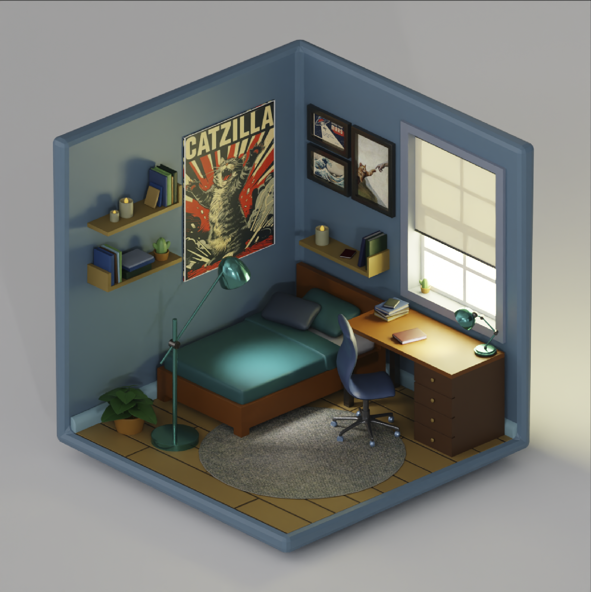

# 🛋️ Isometric Bedroom — Blender 3D

A cozy, stylized isometric bedroom scene modeled and rendered in Blender. The room features a carefully curated mix of everyday objects with a distinct lo-fi / gamer aesthetic.



---

## 🎨 About the Project

This is a personal 3D art project created entirely in **Blender**. The goal was to design a compact, character-filled room using an isometric perspective with stylized low-poly shading and warm lighting.

---

## 🪑 What's in the Room?

| Object | Details |
|---|---|
| 🛏️ Bed | Wooden frame with teal/green bedding and a dark pillow |
| 🪑 Desk Chair | Blue ergonomic gaming chair |
| 🖥️ Desk | Wooden desk with a drawer unit, books, and a teal lamp |
| 📚 Wall Shelves | Two floating shelves with books, a cactus, candles, and a blue binder |
| 🖼️ Posters & Frames | "Catzilla" poster + framed art (The Great Wave, The Creation of Adam) |
| 💡 Floor Lamp | Teal arc floor lamp casting a soft glow |
| 🌿 Plant | A leafy green plant in a terracotta pot |
| 🪟 Window | Large window with blinds letting in warm natural light |
| 🟫 Rug | Round gray rug in the center of the room |
| 🧱 Floor | Warm-toned tile flooring |

---

## 🛠️ Tools & Techniques

- **Software:** Blender 3.x / 4.x
- **Render Engine:** Cycles / EEVEE
- **Style:** Isometric • Low-poly • Stylized
- **Lighting:** Mixed — warm window light + interior lamps
- **Color Palette:** Teal, slate blue, warm wood tones, terracotta

---

## 📁 File Structure

```
📦 isometric-bedroom/
├── 📄 README.md
├── 🖼️ isometric_room.PNG
└── 📂 blend/
    └── Mehmet_Anil_ULKU_IsometricRoom_v01.blend
```

---

## 🚀 How to Open

1. Download and install [Blender](https://www.blender.org/download/)
2. Clone this repository:
   ```bash
   git clone https://github.com/MehmetAnilULKU/isometric-bedroom.git
   ```
3. Open `blend/Mehmet_Anil_ULKU_IsometricRoom_v01.blend` in Blender
4. Press **F12** to render, or explore the scene in the viewport

---

## 📜 License

This project is licensed under the [Creative Commons Attribution 4.0 International (CC BY 4.0)](https://creativecommons.org/licenses/by/4.0/) license.
You are free to share and adapt this work with appropriate credit.

---

## 🙋 Author

**Mehmet Anıl ÜLKÜ**  
Feel free to open an issue or leave a star ⭐ if you liked it!
